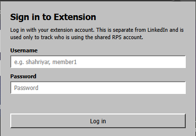
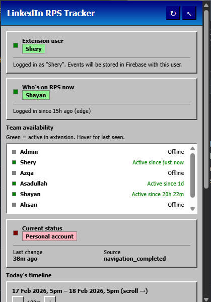
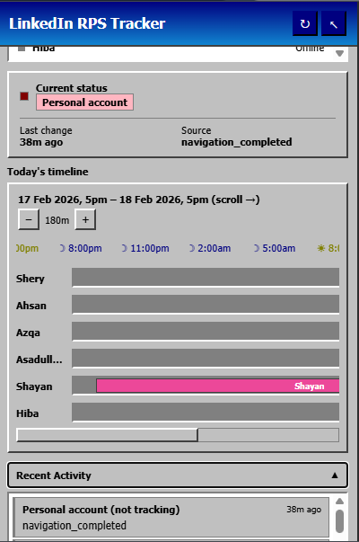
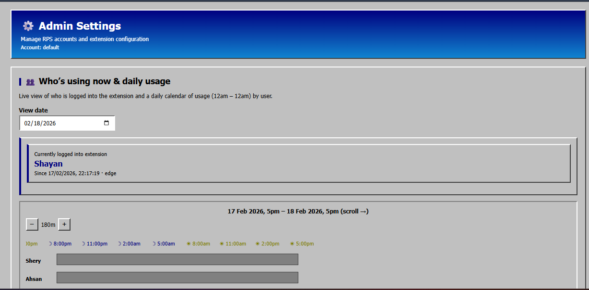
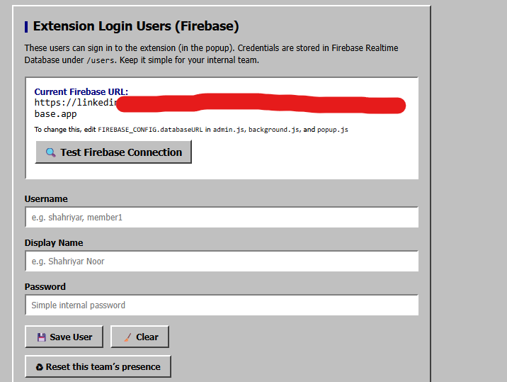
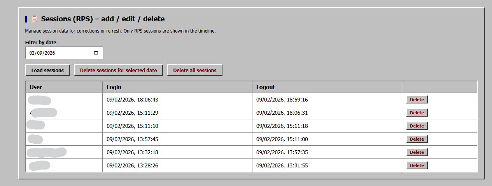

# 🔗 LinkedIn RPS Tracker

A Chrome/Edge browser extension that tracks who is currently using your shared LinkedIn Recruiter (RPS) account in real-time, with team management, daily usage timelines, and multi-team support.








## ✨ Features

### 🎯 Core Functionality

- **Real-time "Who's on RPS now"** – See which team member is currently logged into the shared LinkedIn RPS account
- **Team availability tracking** – Monitor which team members are active in the extension (green = active, gray = offline)
- **Daily usage timeline** – Visual timeline showing who was on RPS when throughout the work day (5pm → 5pm)
- **Session tracking** – Automatic recording of login/logout sessions with timestamps
- **Cross-browser support** – Works across Chrome and Edge, with presence synced via Firebase
- **Multi-team support** – Manage multiple teams/accounts from a single extension installation

### 🔒 Security & Access Control

- **Single-user enforcement** – Prevents the same extension user from being logged in on multiple devices simultaneously
- **Admin password reset** – When admin changes a user's password, that user is automatically logged out from all devices
- **Team-scoped data** – Each team's data is isolated; users only see their own team's information
- **No data scraping** – Extension only tracks login/logout events; no LinkedIn data is scraped or stored

### 👥 Team Management

- **Extension user accounts** – Create user accounts for team members (stored in Firebase)
- **Admin panel** – Team admins can manage users, view sessions, reset presence, and configure settings
- **GOD mode** – Centralized admin interface for managing all teams, accounts, and users across the organization
- **Team names** – Display custom team names in the extension UI

### 📊 Visual Features

- **Windows 98 retro theme** – Classic nostalgic UI design
- **Zoomable timeline** – Mouse wheel zoom and zoom buttons for detailed time analysis
- **Work-day alignment** – Timeline runs from 5pm one day to 5pm the next (configurable)
- **Color-coded sessions** – Each user gets a unique color in the timeline
- **Collapsible sections** – Recent Activity and Debug Log can be collapsed to save space

---

## 🚀 Quick Start

### Prerequisites

- **Chrome** or **Microsoft Edge** (Chromium-based)
- A **Google account** (for Firebase)
- A **LinkedIn Recruiter (RPS) account** to track

### Installation Steps

#### 1. Clone or Download This Repository

```bash
git clone https://github.com/YOUR-USERNAME/linkedin-rps-tracker.git
cd linkedin-rps-tracker
```

Or download as ZIP and extract.

#### 2. Set Up Firebase

1. Go to [Firebase Console](https://console.firebase.google.com/)
2. Click **"Add project"** → Name it (e.g., "LinkedIn RPS Tracker")
3. Create a **Realtime Database**:
   - Go to **Build → Realtime Database**
   - Click **"Create Database"**
   - Choose a region (e.g., `asia-southeast1`)
   - Start in **Test mode** (we'll secure it next)
4. Copy your **Database URL** (shown at the top, e.g., `https://YOUR-PROJECT-ID-default-rtdb.REGION.firebasedatabase.app`)
5. Set up security rules:
   - In Realtime Database → **Rules** tab
   - Copy the entire contents of `database.rules.json` from this project
   - Paste and click **"Publish"**

#### 3. Configure the Extension

You need to set your Firebase URL in **4 files**. Open each file and find `FIREBASE_CONFIG`:

**Files to edit:**
- `popup.js` (line ~2)
- `background.js` (line ~6)
- `admin.js` (line ~8)
- `god.js` (line ~4)

**What to change:**

Replace `YOUR-FIREBASE-DATABASE-URL-HERE` with your actual Firebase Database URL:

```javascript
const FIREBASE_CONFIG = {
  databaseURL: "https://YOUR-PROJECT-ID-default-rtdb.REGION.firebasedatabase.app/"
};
```

**Important:** Use the exact URL from Firebase (no trailing path, just the database root).

#### 4. Install the Extension

1. Open Chrome: `chrome://extensions` (or Edge: `edge://extensions`)
2. Enable **Developer mode** (toggle in top right)
3. Click **"Load unpacked"**
4. Select the project folder (the one containing `manifest.json`)
5. The extension icon should appear in your toolbar

#### 5. Initial Setup (GOD Mode)

1. Open `god.html` in your browser (double-click the file)
2. Click **"Test connection"** to verify Firebase connectivity
3. Create your first account/team:
   - **Account ID**: e.g., `default` or `team-bd`
   - **Team name**: e.g., "BD Team"
   - **RPS LinkedIn email**: The email of your shared RPS account
   - **RPS display name**: e.g., "Company RPS Account"
   - Click **"Save / Update account"**
4. Create your first admin user:
   - **Username**: e.g., `admin`
   - **Display name**: e.g., "Admin"
   - **Password**: Choose a secure password
   - Check **"Is admin"**
   - Click **"Save / Update user"**
5. Create team members:
   - Add users with their usernames, display names, and passwords
   - Select the **Team / Account** from the dropdown
   - Click **"Save / Update user"**

#### 6. Configure Extension Admin (Per Team)

1. Click the extension icon → **Log in** with your admin credentials
2. Click the **gear icon** (⚙️) to open Admin Settings
3. Set **Browser / User ID** (your short identifier, e.g., `shahriyar-office`)
4. In **"LinkedIn RPS Account Configuration"**:
   - **Display Name**: e.g., "Main RPS Account"
   - **Shared Account ID**: Must match the Account ID you created in GOD mode (e.g., `default`)
   - **LinkedIn Email / Username**: Your RPS account email
   - Click **"Add / Update Account"**
   - Click **"Set as active for tracking"** on the account card
5. Click **"Save Settings"**

#### 7. Start Using

1. Log into the extension with your user credentials
2. Log into LinkedIn with your RPS account
3. Navigate to a Recruiter page (e.g., `/talent/`)
4. The extension will detect you're on RPS and show you as "Who's on RPS now"

---

## 📁 Project Structure

```
linkedin-rps-tracker/
├── manifest.json              # Extension manifest (permissions, files)
├── popup.html / popup.js      # Main extension popup UI
├── background.js              # Service worker (cookie monitoring, Firebase writes)
├── content.js                # Content script (runs on LinkedIn pages)
├── admin.html / admin.js     # Team admin panel
├── god.html / god.js         # GOD mode (central admin for all teams)
├── database.rules.json       # Firebase security rules
├── SETUP_README.md           # Detailed setup guide
├── FIREBASE_SETUP.md         # Firebase-specific instructions
├── FIREBASE_TROUBLESHOOTING.md # Firebase troubleshooting
└── README.md                 # This file
```

---

## 🔧 Configuration Guide

### Where to Edit What

#### Firebase Configuration

**Files:** `popup.js`, `background.js`, `admin.js`, `god.js`

**Location:** Top of each file, look for:

```javascript
const FIREBASE_CONFIG = {
  databaseURL: "YOUR-FIREBASE-DATABASE-URL-HERE"
};
```

**What to do:** Replace with your Firebase Realtime Database URL.

---

#### Account/Team Configuration

**Method 1: GOD Mode (Recommended)**

1. Open `god.html` in browser
2. Use the **"Accounts / Teams"** panel to create/update accounts
3. Set `teamName`, `email`, `displayName`, `profilePath`

**Method 2: Extension Admin**

1. Log into extension as admin
2. Open Admin Settings (gear icon)
3. Use **"LinkedIn RPS Account Configuration"** section
4. Set Account ID to match GOD mode account

---

#### User Management

**GOD Mode (All Teams):**
- Open `god.html`
- Use **"Extension users & admins"** panel
- Create users, assign teams, set admin flags

**Extension Admin (Per Team):**
- Log in as team admin
- Open Admin Settings
- Use **"Extension Login Users (Firebase)"** section
- Users are automatically tagged with your team's `accountId`

---

#### Work Day Hours

**Files:** `popup.js` (line ~225), `admin.js` (line ~587)

**Location:** Look for `WORK_DAY_START_HOUR`

```javascript
const WORK_DAY_START_HOUR = 17; // 5pm
```

**What to change:** Set to your work day start hour (24-hour format). Timeline will run from this hour to the same hour next day.

---

#### Timeline Zoom Levels

**Files:** `popup.js`, `admin.js`

**Location:** Look for `TIMELINE_ZOOM_LEVELS` or `ADMIN_ZOOM_LEVELS`

```javascript
const TIMELINE_ZOOM_LEVELS = [
  { pxPerHour: 24, tickMinutes: 180 },  // 3h view
  { pxPerHour: 48, tickMinutes: 60 },   // 1h view
  // ... more levels
];
```

**What to change:** Adjust `pxPerHour` (pixels per hour) and `tickMinutes` (axis tick interval) to customize zoom levels.

---

## 🎨 Customization

### Changing the Theme

The extension uses a Windows 98 retro theme. To customize:

**Files:** `popup.html` (styles), `admin.html` (styles)

**Location:** `<style>` blocks in each HTML file

**Variables to change:**

```css
:root {
  --win-title: #000080;        /* Title bar blue */
  --win-bg: #c0c0c0;           /* Background gray */
  --win-face: #c0c0c0;         /* Button face */
  --win-highlight: #ffffff;    /* 3D highlight */
  --win-shadow: #808080;       /* 3D shadow */
  --win-text: #000000;         /* Text color */
}
```

---

## 🐛 Troubleshooting

### Extension Shows "Firebase URL not configured"

**Solution:** Make sure you've set `FIREBASE_CONFIG.databaseURL` in all 4 files (`popup.js`, `background.js`, `admin.js`, `god.js`) and reloaded the extension.

---

### "Cannot connect to Firebase"

**Check:**
1. Firebase URL is correct (no typos)
2. Database is created and running
3. Security rules are published (`database.rules.json`)
4. No firewall blocking Firebase domains
5. Internet connection is working

**Test:** Use GOD mode's "Test connection" button or Admin page's Firebase test.

---

### "Who's on RPS now" Shows "No one"

**Check:**
1. You're logged into the extension (not just LinkedIn)
2. You're logged into the RPS LinkedIn account (not personal)
3. You're on a Recruiter page (URL contains `/talent/`)
4. Your RPS account email matches `/accounts/{accountId}/config.email` in Firebase
5. Background script is running (check `chrome://extensions` → your extension → "Service worker")

---

### Timeline is Empty

**Check:**
1. You've logged into the extension
2. You've been on RPS (Recruiter pages) while logged in
3. Sessions are being created (check Firebase `/accounts/{accountId}/sessions`)
4. Date filter in admin is set correctly

---

### Team Name Not Showing

**Check:**
1. In GOD mode, you've set `teamName` in `/accounts/{accountId}/config`
2. In Extension Admin, you've set the active Account ID to match
3. You've clicked "Set as active for tracking" in Admin
4. Reload the popup after making changes

---

### Users Appearing Twice in Team Availability

**Solution:** Click **"Reset this team's presence"** in Extension Admin. This clears stale `/extensionOnline` entries for your team.

---

### Same User Can Log In on Multiple Devices

**Check:**
1. Both devices are using the same Firebase database
2. Extension is up to date (reload both)
3. `/extensionOnline/{userId}` is being written correctly

**Fix:** The extension should block this automatically. If it doesn't, check that `loginAsUser` in `popup.js` includes the `/extensionOnline` check.

---

### RPS Account Detected as "Personal account"

**Check:**
1. You're on a Recruiter page (`/talent/` in URL)
2. `/accounts/{accountId}/config.email` matches your RPS login email
3. `accountId` is set correctly in Extension Admin

**Fix:** The extension now detects RPS by URL (`/talent/`) first, then falls back to email matching. If you're on `/talent/` and still see "Personal", check Firebase config.

---

## 📋 Features & Fixes

### ✅ Implemented Features

- ✅ Real-time "Who's on RPS now" tracking
- ✅ Team availability with active/offline status
- ✅ Daily usage timeline (5pm → 5pm work day)
- ✅ Session tracking with login/logout timestamps
- ✅ Multi-team support with team-scoped data
- ✅ Admin panel for user management
- ✅ GOD mode for centralized team/account management
- ✅ Single-user enforcement (no concurrent logins)
- ✅ Password reset forces logout
- ✅ Cross-browser presence sync
- ✅ Zoomable timeline with mouse wheel support
- ✅ Windows 98 retro theme
- ✅ Collapsible Recent Activity / Debug Log
- ✅ Team name display in popup/admin
- ✅ Automatic session cleanup (prevents duplicate active sessions)
- ✅ Login event logging (`rps_login` events in Firebase)
- ✅ Force logout when admin changes password
- ✅ RPS detection by URL (`/talent/`) + email matching
- ✅ Team-scoped user filtering
- ✅ Admin can reset team presence

### 🔧 Technical Improvements

- ✅ Removed all hardcoded Firebase URLs (now configurable)
- ✅ Removed hardcoded RPS account emails/profiles
- ✅ Removed hardcoded admin passwords (now Firebase-based)
- ✅ Centralized Firebase config (4 files, easy to update)
- ✅ Proper error handling and fallbacks
- ✅ Defensive coding to prevent duplicate sessions
- ✅ Team-based data isolation
- ✅ Comprehensive logging for debugging

---

## 🏗️ Architecture

### Data Flow

1. **Background Script** (`background.js`):
   - Monitors LinkedIn cookie changes
   - Detects RPS vs personal account
   - Writes presence to `/accounts/{accountId}/currentUser`
   - Creates sessions in `/accounts/{accountId}/sessions`
   - Writes heartbeat to `/extensionOnline/{userId}`

2. **Popup** (`popup.js`):
   - Reads current user from Firebase
   - Displays team availability
   - Shows daily timeline
   - Handles extension login/logout

3. **Admin Panel** (`admin.js`):
   - Manages extension users
   - Views sessions and timeline
   - Resets team presence
   - Configures account settings

4. **GOD Mode** (`god.js`):
   - Manages all teams/accounts
   - Creates/updates account configs
   - Manages all users across teams
   - Inspects sessions/events

### Firebase Structure

```
/accounts/{accountId}/
  ├── currentUser          # Who's on RPS now
  ├── sessions/            # Login/logout sessions
  ├── events/              # Login events (rps_login)
  ├── state/               # Status history
  └── config/              # Account config (teamName, email, etc.)

/users/{userId}            # Extension user accounts
  ├── username
  ├── displayName
  ├── password
  ├── teamId               # Which team they belong to
  └── forceLogoutAt        # Timestamp when password changed

/admins/{userId}            # Admin flags (true/false)

/extensionOnline/{userId}   # Presence heartbeat
  ├── displayName
  ├── lastSeenAt
  ├── firstSeenAt
  └── clientId
```

---

## 🤝 Contributing

This is a public repository. Feel free to:

- **Report bugs** via Issues
- **Suggest features** via Issues
- **Submit pull requests** for improvements
- **Fork** for your own use

---

## 📝 License

[Add your license here - e.g., MIT, Apache 2.0, or your preferred license]

---

## 👤 Author

**Your Name**

- LinkedIn: [Your LinkedIn Profile]
- GitHub: [Your GitHub Profile]

---

## 🙏 Acknowledgments

- Built for teams sharing LinkedIn Recruiter accounts
- Uses Firebase Realtime Database for real-time sync
- Windows 98 theme inspired by classic computing nostalgia

---

## 📞 Support

For detailed setup instructions, see **SETUP_README.md**.

For Firebase-specific help, see **FIREBASE_SETUP.md** and **FIREBASE_TROUBLESHOOTING.md**.

---

## 🎯 Use Cases

- **Recruiting teams** sharing a single LinkedIn RPS account
- **Sales teams** tracking who's using the shared LinkedIn Premium account
- **Multi-team organizations** managing multiple RPS accounts
- **Time tracking** for RPS account usage
- **Team coordination** to avoid conflicts when multiple people need access

---

**Made with ❤️ for teams that need to share LinkedIn Recruiter accounts efficiently.**
